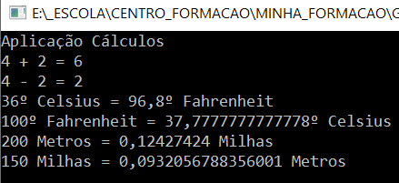

# Cálculos Diversos :1234:

 Aplicação desenvolvida em C# para efetuar diversos cálculos.

 Esta aplicação foi desenvolvida no âmbito da ação de formação **Introdução ao GIT e GITHUB.**

 

## Operações suportadas

Neste momento esta aplicação implementa as seguintes operações:
- Soma;
- Subtração;
- Multiplicação;
- Conversão de Temperaturas:
    - Celsius :arrow_right: Fahrenheit;
    - Fahrenheit :arrow_right: Celsius;
- Conversão de Distâncias:
    - Metros :arrow_right: Milhas;
    - Milhas :arrow_right: Metros.

## Tecnologias usadas

- Visual Studio;
- C#;
- Git;
- GitHub Desktop;
- Plataforma GitHub.

## Site Oficial

Faça download desta aplicação no site oficial. 
[Clique aqui.](#operações-suportadas)
